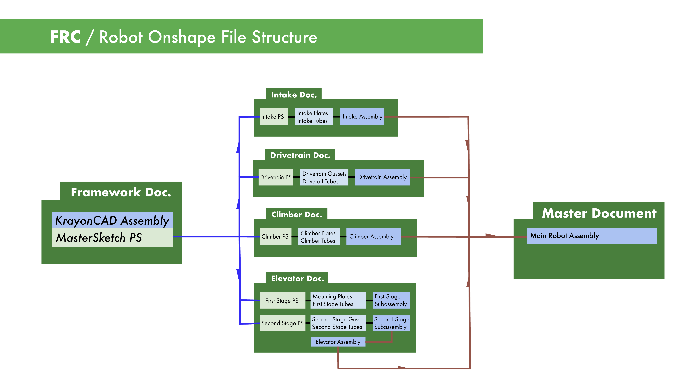

# Document Setup

Top-Down Design uses several documents, consisting of:

- Master Sketches (Contains primary geometry)  
- Mechanisms (Each mechanism gets its own document)  
- Full Assembly (contains the full assembly of all the mechanisms)  

!!! quote "Why do we do this?"

    "In general, an FRC robot is too complicated and has too many parts to be created entirely within a single document. Doing so is possible, but will result in bad loading times, and likely poor organization."  
    **\- [FRCDesign](https://frcdesign.org/best-practices/document-setup/)**

/// caption
Credit: [FRCDesign.org](https://www.frcdesign.org/best-practices/document-setup/)
///

??? info "See Also:"

    [Document Setup | FRCDesign.org](https://www.frcdesign.org/best-practices/document-setup/)
